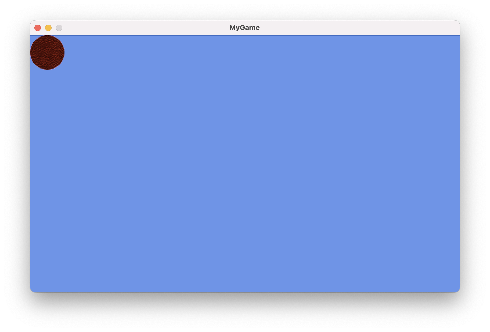

FNA is a reimplementation of the Microsoft XNA Game Studio 4.0 Refresh libraries, 
the framework with which I started learning to create video games.

FNA has good support for Windows and Linux to create a viable environment, but it has some
problems with macOS, specially with M processors. So if you want to develop a FNA game in
macOS is not as simple as seen, but I finally got to have a setup in my Mac.

If you want to develop games in macOS using FNA, follow these steps, these are working for
me, but I can't guarantee that it will work 100% for you. If you have problems, you can
join to the [Discord Server](https://discord.com/invite/2Gg8zju).

## Install brew

First of all, we need to setup brew to be able to install all the requirements.

```shell
/bin/bash -c "$(curl -fsSL https://raw.githubusercontent.com/Homebrew/install/HEAD/install.sh)"
```

## Install the required prerequisites

Once you have installed brew, now is time to install python, cmake and git.

```shell
brew install cmake python3 git
```

## Get the fnalibs and compile for the platform

This is the more important step, FNA uses natives libraries to develop and run games, 
the FNA team provides the native libraries for Windows, Linux, and x86_64 macOS but for
arm64 we need to compile by our self, but thanks to `TheSpydog` and his repo, we can compile
our libraries easier than before.

First, you need to download the repo: [https://github.com/TheSpydog/fnalibs-apple-builder](https://github.com/TheSpydog/fnalibs-apple-builder)

The repo has clear instructions for building, so we only need to reproduce here.

For example, if you download the repo in the `Download` folder, you need to go to the folder
in the terminal and run the commands.

```shell
cd ~/Downloads
./updatelibs
./buildlibs macos    # Build for mac, you can build for ios/ios-sim/tvos/tvos-sim/all too
```

After building the libraries, you are going to have a bin directory where you are going to
find the native libraries that you are going to use.

## Install dotnet 8

FNA uses C# to write games, so we need to install dotnet in your mac, go to the
[official site ](https://dotnet.microsoft.com/en-us/download) and install the Arm64 version.

## Create your project

Finally we can create our project for our game. Open to your terminal, then go to the location
where you are going to put your project.

```shell
cd ~/Desktop
mkdir MyGame
cd MyGame
dotnet new sln      # Create a solution file to add the projects
dotnet new console -o MyGame
dotnet sln add MyGame/MyGame.csproj
```

You need to add the FNA repo, the [FNA FAQ's](https://fna-xna.github.io/docs/0%3A-FAQ/#where-is-the-nuget-package) has
a explanation why they are not using NuGet packages, so, in the terminal run the this command.

```shell
git clone --recursive https://github.com/FNA-XNA/FNA
dotnet sln add FNA/FNA.Core.csproj   # Add the core project because we are using dotnet core
```

We need to add the reference in our project so we can get the FNA Framework working in our code.

```shell
cd MyGame
dotnet add reference ../FNA/FNA.Core.csproj
```

Once we have created the reference, we need to build our project.

```shell
dotnet build
```

The build command, is going to generate a `build` directory, you need to put the native libraries
that compiled early in the `build/Debu/net8.0` path.


## Creating the Content folder

If you have used Monogame or XNA, you know that we need to use a Content Pipeline to convert the files
in a `.xnb` format. In FNA we have more freedom in our assets, 

The FNA documentation says:


>FNA supports loading common data formats like PNG, WAV and OGG directly, 
>and the community maintains a few libraries for font loading and rendering.

But we want to emulate XNA, so in your project root folder, create a folder and named
`Content`.


But we need a little of configuration in the `MyGame.csproj` to add the Content folder
to our bin directory. Open and modify `MyGame.csproj` to add the next code.

```xml
<ItemGroup>
    <None Include="Content\**" CopyToOutputDirectory="PreserveNewest" />
</ItemGroup>
```

Your file should looks like this:

```xml
<Project Sdk="Microsoft.NET.Sdk">

  <ItemGroup>
    <ProjectReference Include="..\FNA\FNA.Core.csproj" />
  </ItemGroup>

  <ItemGroup>
    <None Include="Content\**" CopyToOutputDirectory="PreserveNewest" />
  </ItemGroup>

  <PropertyGroup>
    <OutputType>Exe</OutputType>
    <TargetFramework>net8.0</TargetFramework>
  </PropertyGroup>

</Project>
```

## Test our FNA setup

Now, is time to test and see if all the steps are working.

First, download the ball image (I took from [Monogame Tutorial](https://docs.monogame.net/articles/getting_started/4_adding_content.html))
and save it as `ball.png` in the `Content` folder.


Now, replace the `Program.cs` file with this code

```csharp
using System;

static class Program
{
    [STAThread]
    static void Main()
    {
        using (var g = new MainGame())
        {
            g.Run();
        }
    }
}
```

Create a new file and named it `MainGame.cs` and add this code

```csharp
using Microsoft.Xna.Framework;
using Microsoft.Xna.Framework.Graphics;
using Microsoft.Xna.Framework.Input;

public class MainGame : Game
{
    private GraphicsDeviceManager _graphics;
    private SpriteBatch _spriteBatch;

    Texture2D ballTexture;

    public MainGame()
    {
        _graphics = new GraphicsDeviceManager(this);
        Content.RootDirectory = "Content";
    }

    protected override void Initialize()
    {

        // TODO: Add your initialization logic here

        base.Initialize();
    }

    protected override void LoadContent()
    {
        _spriteBatch = new SpriteBatch(GraphicsDevice);
        ballTexture = Content.Load<Texture2D>("ball");
    }

    protected override void UnloadContent()
    {
        base.UnloadContent();
    }

    protected override void Update(GameTime gameTime)
    {
        if (GamePad.GetState(PlayerIndex.One).Buttons.Back == ButtonState.Pressed || Keyboard.GetState().IsKeyDown(Keys.Escape))
            Exit();

        // TODO: Add your game logic here

        base.Update(gameTime);
    }

    protected override void Draw(GameTime gameTime)
    {
        _graphics.GraphicsDevice.Clear(Color.CornflowerBlue);

        // TODO: Add your drawing code here
        _spriteBatch.Begin();
        _spriteBatch.Draw(ballTexture, new Vector2(0, 0), Color.White);
        _spriteBatch.End();

        base.Draw(gameTime);
    }
}
```

This is a code that was generated in the template of XNA (I just added the ball), and it is
a good template for start with your game.

## Running the game

Now you can run your game

```shell
dotnet run
```


You should see our FNA window with a ball :D



From here, you can read XNA, Monogame and FNA tutorials to learn more or if you are 
a experience developer you can test your ideas.
